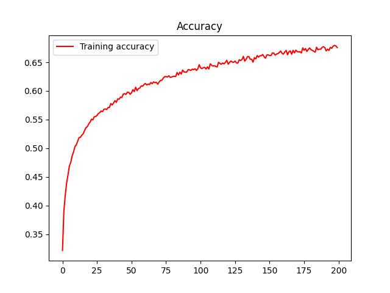
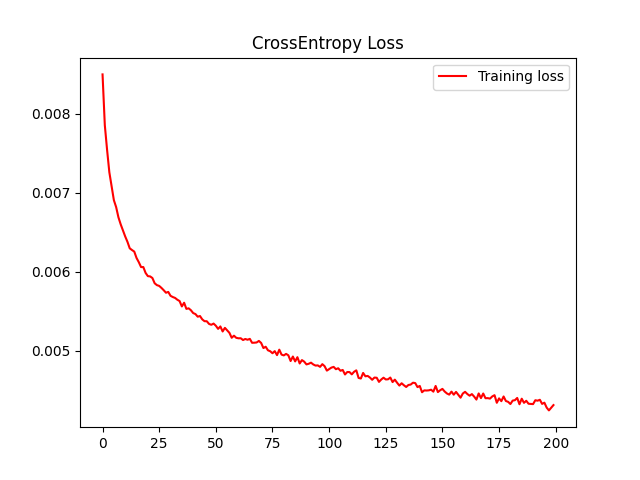
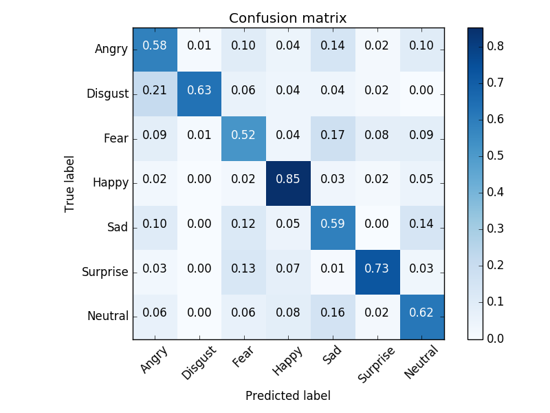
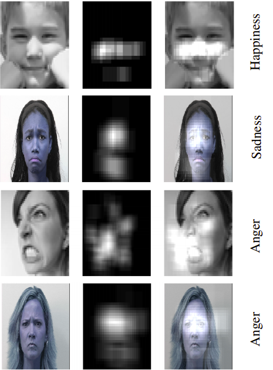

## Faccial Expression Recognition

Ce répo est une implémentation pytorch du papier [Deep-Emotion](https://arxiv.org/abs/1902.01019)

## Arhcitecture

Réseaux convolutionel avec attention, comme le montre la figure suivante.

  

## Environement : 

* pytorch 
* torchvision
* opencv
* tqdm
* PIL

## Datasets :
* [FER2013](https://www.kaggle.com/c/challenges-in-representation-learning-facial-expression-recognition-challenge/data)

*   train.csv : emotion ---> label , pixels ---> data (raw string pixels)
*   test.csv  : pixels ---> data (raw string pixels)

## Code :

* [prepare_data](/prepare_data.py) Ce fichier permet de construire les images à partir des fichiers csv et de générer donc les repertoires des images train, test val

## Manuelle de utilisation :

### Préparation de l'environement :

* pip install -r requirements.txt
 
### Préparation des datasets :
* Télécharger les données à partir du lien cité ci-dessus [FER13]https://www.kaggle.com/c/challenges-in-representation-learning-facial-expression-recognition-challenge/data)

* Lancer le script prepare_data.py

### Apprentissage du modèle Deep Emotion :

* Lancer le script train.py (le script fait égakement l'évaluation du modèles en validation)

* Résultats en train ci-dessous :

  

  

#### Matrice de confusion :

  

#### Silent Map :

  

### Test du modèle FER en temps-réel avec la webcam:

* Lancer le script cam_FaceEmotion.py , avec le chemin du modèle pre-entrainé en argyment (deep-emotion2-200-128-0.005.pt)
* Le script cam_FaceDetection.py fait uniquement la détéction du visage à partir de la webcam et non pas la detection de sentiment.

